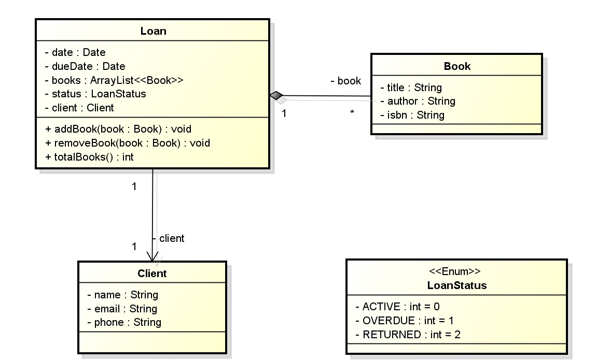

# 📚 Sistema de Empréstimo de Livros  

## 📌 Descrição do Projeto  
Este projeto gerencia o empréstimo de livros para clientes, permitindo controlar os livros emprestados, prazos de devolução e status do empréstimo.  

---

## 📊 Diagrama UML  
  

---

## 📂 Estrutura do Projeto  

### 🔹 Classes Principais  

#### 1. *Loan (Empréstimo)*  
   - Representa um empréstimo de livros.  
   - *Atributos*:
     - 📅 date: Data do empréstimo.  
     - ⏳ dueDate: Data limite para devolução.  
     - 📚 books: Lista de livros incluídos no empréstimo.  
     - 🔄 status: Status do empréstimo (Ativo, Atrasado, Devolvido).  
     - 👤 client: Cliente que pegou o empréstimo.  
   - *Métodos*:
     - addBook(Book book): Adiciona um livro ao empréstimo.  
     - removeBook(Book book): Remove um livro do empréstimo.  
     - totalBooks(): Retorna o número total de livros emprestados.  

#### 2. *Client (Cliente)*  
   - Representa um cliente que realiza o empréstimo.  
   - *Atributos*:
     - 🏷 name: Nome do cliente.  
     - 📧 email: E-mail do cliente.  
     - 📞 phone: Telefone do cliente.  

#### 3. *Book (Livro)*  
   - Representa um livro disponível para empréstimo.  
   - *Atributos*:
     - 📖 title: Título do livro.  
     - ✍ author: Autor do livro.  
     - 🔢 isbn: Código ISBN do livro.  

#### 4. *LoanStatus (Enumeração)*  
   - Define os possíveis estados de um empréstimo:  
     - 🟢 ACTIVE = 0 (Empréstimo ativo).  
     - 🔴 OVERDUE = 1 (Empréstimo atrasado).  
     - ✅ RETURNED = 2 (Livro devolvido).  

---

## 🚀 Funcionalidades  
✅ Registrar novos clientes.  
✅ Criar e gerenciar empréstimos de livros.  
✅ Adicionar e remover livros de um empréstimo.  
✅ Calcular o total de livros emprestados.  
✅ Alterar o status do empréstimo.  

---

## ⚙ Tecnologias Utilizadas  
- ☕ *Java 17+*  
- 🔹 *Paradigma Orientado a Objetos (POO)*  
- 📂 *Coleções Java (ArrayList)*  
- 🏷 *Enumerações*  

---

## ▶ Como Executar  
1. Clone o repositório:  
   ```bash
   git clone https://github.com/Artur14seni/EcercicioComposicao-Java2.git
